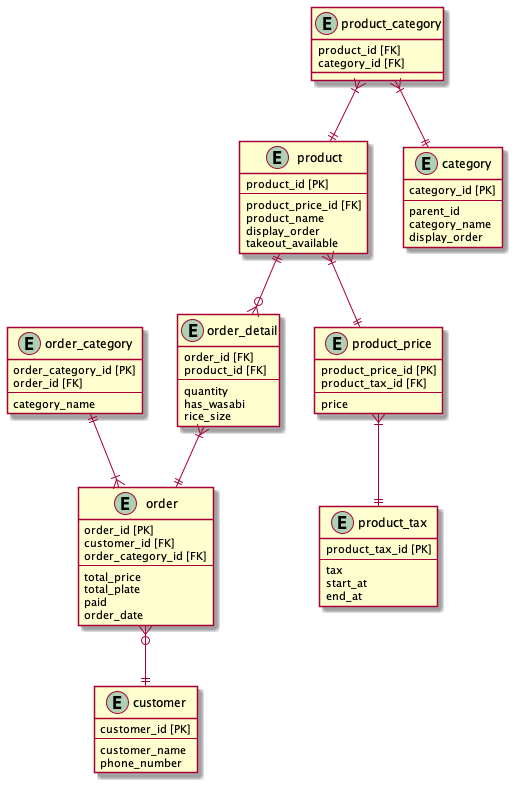

### DBモデリング1

* 横着して全ての課題入りのER図にまとめています。
* 課題1
  * カテゴリーの管理方法
    * 商品は複数のカテゴリを持つ→prodcut_categoryで管理する。
    * category.parent_idでメインかサブカテゴリなどの階層構造を表現する。
      * 例：product:はな、category:セットメニュー(parent_id=0),盛り込み(parent_id=1),
      * [参考にした記事](https://fuminori14.hatenablog.com/entry/20120920/1348147599)
* 課題2
  * order_detailテーブルにrice_sizeカラムを追加。
  * セットメニュー以外のproductのorder_detail.quantityを集計する。
    * SQLが複雑になりそうかも
    * productテーブルにセット品か判定するフラグを追加しても良いのか
    * そもそも、セット品とお好みすしのマスタを分けるとか
* 課題3
  * 追加仕様
    * 店舗での注文以外に、ウーバイーツや、出前館などでも注文できるようにorder_categoryテーブルを追加。

