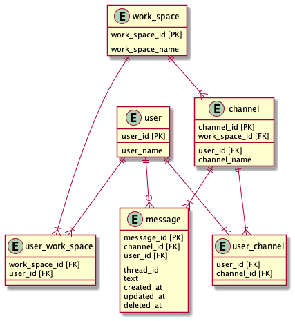

### DBモデリング2

#### ポイント
* ユーザーのワークスペースとチャネルへの所属を中間テーブルで管理
  * ワークスペース・チャネルに参加した場合、中間テーブルに登録
  * ワークスペースから脱退した場合
    * user_work_spaceから1レコード物理削除
    * user_idに紐づく、user_channelのレコードを全て物理削除
  * チャネルから脱退した場合
    * user_channelから1レコード物理削除
* メッセージとスレッドメッセージを1テーブルで管理
  * 横断的に検索する際に1テーブルのみ対象となるので、クエリがシンプルになる
* メッセージ(親)とスレッドメッセージ(子)をthread_idで表現する
  * メッセージとスレッドメッセージは同じthread_idとなり、created_atが一番古い物がメッセージとなる
  * メッセージを削除した場合
    * deleted_atに削除日時を入れる
    * アプリ内で、メッセージかつ削除日時が登録されているものを判別し、`このメッセージは削除されました。`をmessage.textの変わりに表示する
  * スレッドメッセージを削除した場合
    * deleted_atに削除日時を入れる
    * アプリ内で、メッセージ以外(スレッドメッセージ)かつ削除日時が登録されているものを判別し、対象のスレッドメッセージを非表示にする

